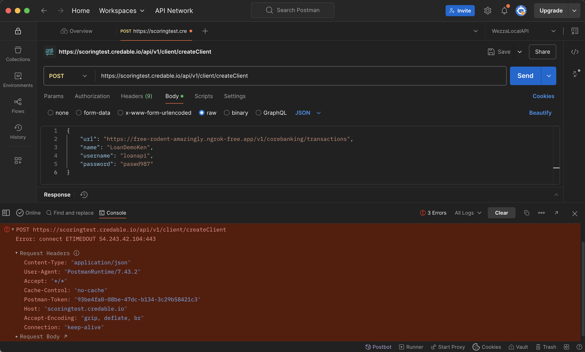

## Credable API demo

Github repo:

Video link:

#### Pre-requisites
To run the app on your machine you will need the following installed:
1. Node.js v20.18.3 or later
2. Yarn package manager
3. Python3 (needed by some packages used by the app)
4. Mockoon (Mock API server)

You can alternatively run the app with docker. You will need to ensure you have docker installed
on your machine.

#### Running the app
Ensure you create a .env or .env.docker file in the root folder of the project before running the app.
You can check the env_example file to see which environment variables to set. You can also check the
`./src/config/index.ts` file to see all the env vars in use and their defaults.

Run without docker:
1. Run mockoon and import the file `./loan-demo-mock-server.json` into the application then run the mock server
2. Run the command: `yarn install`
3. Run the command: `yarn run start:dev`

Sample env values

```
MOCK_API_ENABLED=true
SCORING_API_BASEURL=http://localhost:3001
AUTH_BASIC_USERNAME=loan-api-demo
AUTH_BASIC_PASSWORD=U64ZpJIKFbbye2
```

Run with docker
1. Run the command `yarn run start:dev-docker`

Sample env values

```
HOST=0.0.0.0
PORT=3000
MOCK_API_ENABLED=true
SCORING_API_BASEURL=http://mock-server:3001
CACHE_HOST=cache
CACHE_PORT=6379
AUTH_BASIC_USERNAME=loan-api-demo
AUTH_BASIC_PASSWORD=U64ZpJIKFbbye2
```

#### Project description and important notes
This project consists of 3 modules: scoring, core-banking and lms.

I used a mock API server because I could not get a response from the provided scoring API url.


I could not simulate the scoring API making a call to my API that would trigger a call to the core-banking
module to fetch transactions. However, I have added the core-banking middleware code in place to showcase a
proof of concept on how it can parse xml data and convert it to json for SOAP related requests.

A client application is meant to interact with the lms module. To simulate the createClient behaviour,
an additional endpoint in the scoring module was also exposed to achieve this.

Features implemented:
1. Basic authication for all exposed endpoints
2. Caching capability that acts as both a pub/sub and storage of loan applications
3. Ability to simulate loan applications, prevent new application if existing application in progress and
   retry mechanism to check scoring status.
4. Containerized app to easily run full solution locally end to end.
5. Core banking module that can convert xml to json
6. Postman collection to showcase implemented endpoints can be found here: `./assets/Credable-API-demo.postman_collection.json`

N.B. Should the credable scoring API service have worked, exposing my app with `[ngrok](https://ngrok.com/docs/getting-started/)` would have allowed me to
test the "live" version of the scoring process end to end.


